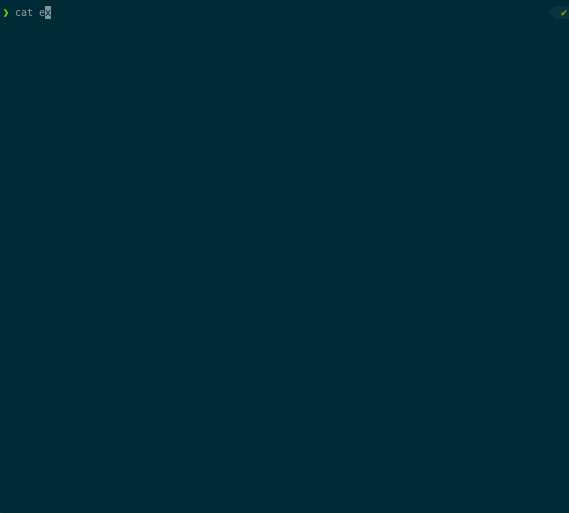

# 🐍 Venom

Venom run executors (script, HTTP Request, etc. ) and assertions.
It can also output xUnit results files.



* [Command Line](#command-line)
* [Docker image](#docker-image)
* [TestSuites](#testsuites)
* [Executors](#executors)
  * [User defined executors](#user-defined-executors)
* [Variables](#variables)
  * [Testsuite variables](#testsuite-variables)
    * [Variable on Command Line](#variable-on-command-line)
    * [Variable Definitions Files](#variable-definitions-files)
    * [Environment Variables](#environment-variables)
    * [Variable helpers](#variable-helpers)
  * [How to use outputs from a test step as input of another test step](#how-to-use-outputs-from-a-test-step-as-input-of-another-test-step)
  * [Builtin venom variables](#builtin-venom-variables)
* [Tests Report](#tests-report)
* [Assertion](#assertion)
  * [Keywords](#keywords)
* [Advanced usage](#advanced-usage)
  * [Debug your testsuites](#debug-your-testsuites)
  * [Skip testcase](#skip-testcase)
* [Use venom in CI](#use-venom-in-ci)
* [Hacking](#hacking)
* [License](#license)

# Command Line

Download latest binary release from https://github.com/ovh/venom/releases

```bash
$ venom run -h

$ venom run *.yml

Notice that variables initialized with -var-from-file argument can be overrided with -var argument.

Usage:
  venom run [flags]

Flags:
      --format string           --format:yaml, json, xml, tap (default "xml")
  -h, --help                    help for run
      --output-dir string       Output Directory: create tests results file inside this directory
      --stop-on-failure         Stop running Test Suite on first Test Case failure
      --var strings             --var cds='cds -f config.json' --var cds2='cds -f config.json'
      --var-from-file strings   --var-from-file filename.yaml --var-from-file filename2.yaml: yaml, must contains a dictionnary
  -v, --verbose count           verbose. -vv to very verbose and -vvv to very verbose with CPU Profiling
```

You can define the arguments with environment variables:

```bash
venom run my-test-suite.yml --format=json
# is the same as
VENOM_FORMAT=json venom run my-test-suite.yml
```

```
      --format           -  example: VENOM_FORMAT=json
      --output-dir       -  example: VENOM_OUTPUT_DIR=.
      --stop-on-failure  -  example: VENOM_STOP_ON_FAILURE=true
      --var              -  example: VENOM_VAR="foo=bar"
      --var-from-file    -  example: VENOM_VAR_FROM_FILE="fileA.yml fileB.yml"
      -v                 -  example: VENOM_VERBOSE=2 is the same as -vv
```

You can define the venom settings using a configuration file `.venomrc`. This configuration file should be placed in the current directory or in the home directory.

```yml
variables: 
  - foo=bar
variables_files:
  - my_var_file.yaml
stop_on_failure: true
format: xml
output_dir: output
verbosity: 3
```

Please note that command line flags overrides the configuration file. Configuration file overrides the environment variables.

# Docker image

Venom can be started inside a docker image with:
```bash
$ git clone git@github.com:ovh/venom.git
$ cd venom
$ docker run -it $(docker build -q .) --rm -v $(pwd)/outputs:/outputs -v $(pwd):/tests run /tests/testsuite.yaml
```

# TestSuites

A test suite is a collection of test cases that are intended to be used to test a software program to show that it has some specified set of behaviours.
A test case is a specification of the inputs, execution conditions, testing procedure, and expected results that define a single test to be executed to achieve a particular software testing objective, such as to exercise a particular program path or to verify compliance with a specific requirement.

In `venom` the testcases are executed sequentially within a testsuite. Each testcase is an ordered set of steps. Each step is based on an `executor` that enable some specific kind of behavior.

In `venom` a testsuite is written in one `yaml` file respecting the following structure.

```yaml

name: Title of TestSuite
testcases:
- name: TestCase with default value, exec cmd. Check if exit code != 1
  steps:
  - script: echo 'foo'
    type: exec

- name: Title of First TestCase
  steps:
  - script: echo 'foo'
    assertions:
    - result.code ShouldEqual 0
  - script: echo 'bar'
    assertions:
    - result.systemout ShouldNotContainSubstring foo
    - result.timeseconds ShouldBeLessThan 1

- name: GET http testcase, with 5 seconds timeout
  steps:
  - type: http
    method: GET
    url: https://eu.api.ovh.com/1.0/
    timeout: 5
    assertions:
    - result.body ShouldContainSubstring /dedicated/server
    - result.body ShouldContainSubstring /ipLoadbalancing
    - result.statuscode ShouldEqual 200
    - result.timeseconds ShouldBeLessThan 1

- name: Test with retries and delay in seconds between each try
  steps:
  - type: http
    method: GET
    url: https://eu.api.ovh.com/1.0/
    retry: 3
    delay: 2
    assertions:
    - result.statuscode ShouldEqual 200

```

# Executors

* **dbfixtures**: https://github.com/ovh/venom/tree/master/executors/dbfixtures
* **exec**: https://github.com/ovh/venom/tree/master/executors/exec `exec` is the default type for a step
* **grpc**: https://github.com/ovh/venom/tree/master/executors/grpc
* **http**: https://github.com/ovh/venom/tree/master/executors/http
* **imap**: https://github.com/ovh/venom/tree/master/executors/imap
* **kafka** https://github.com/ovh/venom/tree/master/executors/kafka
* **odbc**: https://github.com/ovh/venom/tree/master/executors/plugins/odbc
* **ovhapi**: https://github.com/ovh/venom/tree/master/executors/ovhapi
* **rabbitmq**: https://github.com/ovh/venom/tree/master/executors/rabbitmq
* **readfile**: https://github.com/ovh/venom/tree/master/executors/readfile
* **redis**: https://github.com/ovh/venom/tree/master/executors/redis
* **smtp**: https://github.com/ovh/venom/tree/master/executors/smtp
* **sql**: https://github.com/ovh/venom/tree/master/executors/sql
* **ssh**: https://github.com/ovh/venom/tree/master/executors/ssh
* **web**: https://github.com/ovh/venom/tree/master/executors/web

## User defined executors

You can define an executor with a single yaml file. This is a good way to abstract technical or functional behaviors and reuse them in complex testsuites.

Example:

file `lib/customA.yml`
```yml
executor: hello
input:
  myarg: {}
steps:
- script: echo "{\"hello\":\"{{.input.myarg}}\"}"
  assertions:
  - result.code ShouldEqual 0
output:
  display:
    hello: "{{.result.systemoutjson.hello}}"
```

file `testsuite.yml`
```yml
name: testsuite with a user executor
testcases:
- name: testA
  steps:
  - type: hello
    myarg: World
    assertions:
    - result.display.hello ShouldContainSubstring World
```

venom will load user's executors from the directory `lib/`
- from the path of the testsuite
- from the venom path

```bash
$ venom run testsuite.yml # lib/*.yml files will be loaded as executors.
```

# Variables

## Testsuite variables

You can define variable on the `testsuite` level.

```yaml
name: myTestSuite
vars:
  foo: foo
  biz:
    bar: bar

testcases:
- name: first-test-case
  steps:
  - type: exec
    script: echo '{{.foo}} {{.biz.bar}}'
    assertions:
    - result.code ShouldEqual 0
    - result.systemout ShouldEqual "foo bar"
...
```

Each user variable used in testsuite must be declared in this section. You can override its value at runtime in a number of ways:
- Individually, with the `--var` command line option.
- In variable definitions files, either specified on the command line `--var-from-file`.
- As environment variables.


### Variable on Command Line

To specify individual variables on the command line, use the `--var` option when running the `venom run` commands:

```
venom run --var="foo=bar"
venom run --var='foo_list=["biz","buz"]'
venom run --var='foo={"biz":"bar","biz":"barr"}'
```

The `--var` option can be used many times in a single command.

### Variable Definitions Files

To set lots of variables, it is more convenient to specify their values in a variable definitions file. This file is a YAML dictionnary and you have specify that file on the command line with `--var-from-file`

### Environment Variables

As a fallback for the other ways of defining variables, `venom` searches the environment of its own process for environment variables named `VENOM_VAR_` followed by the name of a declared variable.

```bash
$ export VENOM_VAR_foo=bar
$ venom run *.yml
```

### Variable helpers

Available helpers and some examples:

- `abbrev`
- `abbrevboth`
- `trunc`
- `trim`
- `upper`: {{.myvar | upper}}
- `lower`: {{.myvar | lower}}
- `title`
- `untitle`
- `substr`
- `repeat`
- `trimall`
- `trimAll`
- `trimSuffix`
- `trimPrefix`
- `nospace`
- `initials`
- `randAlphaNum`
- `randAlpha`
- `randASCII`
- `randNumeric`
- `swapcase`
- `shuffle`
- `snakecase`
- `camelcase`
- `quote`
- `squote`
- `indent`
- `nindent`
- `replace`: {{.myvar | replace "_" "."}}
- `plural`
- `default`: {{.myvar | default ""}}
- `empty`
- `coalesce`
- `toJSON`
- `toPrettyJSON`
- `b64enc`
- `b64dec` {{.result.bodyjson | b64enc}}
- `escape`: replace ‘_‘, ‘/’, ‘.’ by ‘-’


## How to use outputs from a test step as input of another test step

To be able to reuse a property from a teststep in a following testcase or step, you have to extract the variable, as the following example. 

After the first step execution, `venom` extracts a value using a regular expression `foo with a ([a-z]+) here` from the content of the `result.systemout` property returned by the `executor`.
Then it is able to reuse this variable with the name `testA.myvariable` with `testA` corresponding to the name of the testcase.

```yaml
name: MyTestSuite
testcases:
- name: testA
  steps:
  - type: exec
    script: echo 'foo with a bar here'
    vars:
      myvariable:
        from: result.systemout
        regex: foo with a ([a-z]+) here

- name: testB
  steps:
  - type: exec
    script: echo {{.testA.myvariable}}
    assertions:
    - result.code ShouldEqual 0
    - result.systemout ShouldContainSubstring bar
```

## Builtin venom variables

```yaml
name: MyTestSuite
testcases:
- name: testA
  steps:
  - type: exec
    script: echo '{{.venom.testsuite}} {{.venom.testsuite.filename}} {{.venom.testcase}} {{.venom.teststep.number}} {{.venom.datetime}} {{.venom.timestamp}}'
    # will display something as: MyTestSuite MyTestSuiteWithVenomBuiltinVar.yml testA 0 2018-08-05T21:38:24+02:00 1533497904

```

Builtin variables:

* {{.venom.testsuite}}
* {{.venom.testsuite.filename}}
* {{.venom.testsuite.shortName}}
* {{.venom.testsuite.workdir}}
* {{.venom.testcase}}
* {{.venom.teststep.number}}
* {{.venom.datetime}}
* {{.venom.timestamp}}

# Tests Report

```bash
venom run --format=xml --output-dir="."
```

Available formats: jUnit (xml), json, yaml, tap reports

# Assertion

## Keywords

* ShouldEqual
* ShouldNotEqual
* ShouldAlmostEqual
* ShouldNotAlmostEqual
* ShouldBeNil
* ShouldNotBeNil
* ShouldBeTrue
* ShouldBeFalse
* ShouldBeZeroValue
* ShouldBeGreaterThan
* ShouldBeGreaterThanOrEqualTo
* ShouldBeLessThan
* ShouldBeLessThanOrEqualTo
* ShouldBeBetween
* ShouldNotBeBetween
* ShouldBeBetweenOrEqual
* ShouldNotBeBetweenOrEqual
* ShouldContain
* ShouldNotContain
* ShouldContainKey
* ShouldNotContainKey
* ShouldBeIn
* ShouldNotBeIn
* ShouldBeEmpty
* ShouldNotBeEmpty
* ShouldHaveLength
* ShouldStartWith
* ShouldNotStartWith
* ShouldEndWith
* ShouldNotEndWith
* ShouldBeBlank
* ShouldNotBeBlank
* ShouldContainSubstring
* ShouldNotContainSubstring
* ShouldEqualTrimSpace
* ShouldHappenBefore
* ShouldHappenOnOrBefore
* ShouldHappenAfter
* ShouldHappenOnOrAfter
* ShouldHappenBetween
* ShouldNotExist

Most assertion keywords documentation can be found on https://pkg.go.dev/github.com/ovh/venom/assertions.


# Advanced usage
## Debug your testsuites

There is two ways to debug a testsuite:
 - use `-v` flag on venom binary.
   - `$ venom run -v test.yml` will output a venom.log file
   - `$ venom run -vv test.yml` will output a venom.log file and dump.json files for each teststep.
 - use `info` keyword your teststep:
`test.yml` file:
```yml
name: Exec testsuite
testcases:
- name: testA
  steps:
  - type: exec
    script: echo 'foo with a bar here'
    info:
      - this a first info
      - and a second...
- name: cat json
  steps:
  - script: cat exec/testa.json
    info: "the value of result.systemoutjson is {{.result.systemoutjson}}"
    assertions:
    - result.systemoutjson.foo ShouldContainSubstrin bar
```

```bash
$ venom run test.yml

# output:

 • Exec testsuite (exec.yml)
 	• testA SUCCESS
	  [info] this a first info (exec.yml:8)
	  [info] and a second... (exec.yml:9)
 	• testB SUCCESS
 	• sleep 1 SUCCESS
 	• cat json SUCCESS
	  [info] the value of result.systemoutjson is map[foo:bar] (exec.yml:34)
```

## Skip testcase

It is possible to skip `testcase` according to some `assertions`. For instance, the following example will skip the last testcase.

```yaml
name: "Skip testsuite"
vars:
  foo: bar

testcases:
- name: init
  steps:
  - type: exec
    script: echo {{.foo}}
    assertions:
    - result.code ShouldEqual 0
    - result.systemout ShouldContainSubstring bar

- name: do-not-skip-this
  skip: 
  - foo ShouldNotBeEmpty
  steps:
  - type: exec
    script: exit 0

- name: skip-this
  skip: 
    - foo ShouldBeEmpty
  steps:
  - type: exec
    script: command_not_found
    assertions:
    - result.code ShouldEqual 0

```

# Use venom in CI

Venom can be use on dev environement or your CI server.
To display correctly the venom output, you probably will have to export the environment variable `IS_TTY=true` before running venom.

# Hacking

[How to write your own executor?](https://github.com/ovh/venom/tree/master/executors#venom-executor)

How to compile?
```bash
$ make build
```

# License

Copyright 2020 OVH SAS

Licensed under the Apache License, Version 2.0 (the "License");
you may not use this file except in compliance with the License.
You may obtain a copy of the License at

    http://www.apache.org/licenses/LICENSE-2.0

Unless required by applicable law or agreed to in writing, software
distributed under the License is distributed on an "AS IS" BASIS,
WITHOUT WARRANTIES OR CONDITIONS OF ANY KIND, either express or implied.
See the License for the specific language governing permissions and
limitations under the License.
